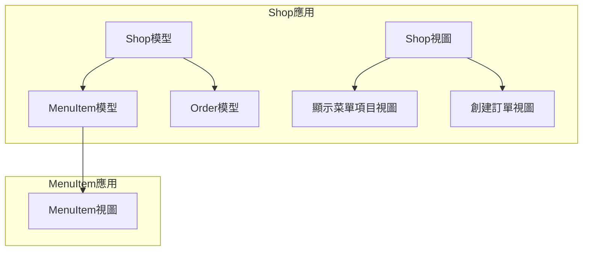
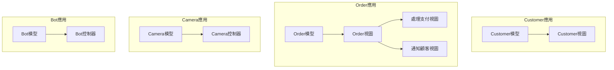

# 交易系統後端應用介紹

## Shop 應用

Shop 應用包含了以下模型和視圖：

- **Shop 模型：** 商店資訊，與菜單項目模型和訂單模型有關聯。
- **MenuItem 模型：** 菜單項目資訊。
- **Order 模型：** 訂單資訊。

Shop 應用的視圖包括：

- **顯示菜單項目視圖：** 用於顯示商店的菜單項目。
- **創建訂單視圖：** 用於創建新的訂單。

## MenuItem 應用

MenuItem 應用包含了以下模型和視圖：

- **MenuItem 模型：** 菜單項目資訊。

MenuItem 應用的視圖包括：

- **MenuItem 視圖：** 用於顯示和處理菜單項目。

## Customer 應用

Customer 應用包含了以下模型和視圖：

- **Customer 模型：** 顧客資訊。

Customer 應用的視圖包括：

- **Customer 視圖：** 用於顯示和管理顧客資訊。

## Order 應用

Order 應用包含了以下模型和視圖：

- **Order 模型：** 訂單資訊。

Order 應用的視圖包括：

- **Order 視圖：** 用於顯示和管理訂單。
- **處理支付視圖：** 用於處理訂單支付。
- **通知顧客視圖：** 用於通知顧客訂單狀態。

## Camera 應用

Camera 應用包含了以下模型和控制器：

- **Camera 模型：** 相機資訊。
- **Camera 控制器：** 用於控制相機。

## Bot 應用

Bot 應用包含了以下模型和控制器：

- **Bot 模型：** 機器人資訊。
- **Bot 控制器：** 用於控制機器人。

這些應用之間建立了相應的模型和視圖，形成了一個完整的後端應用系統。
