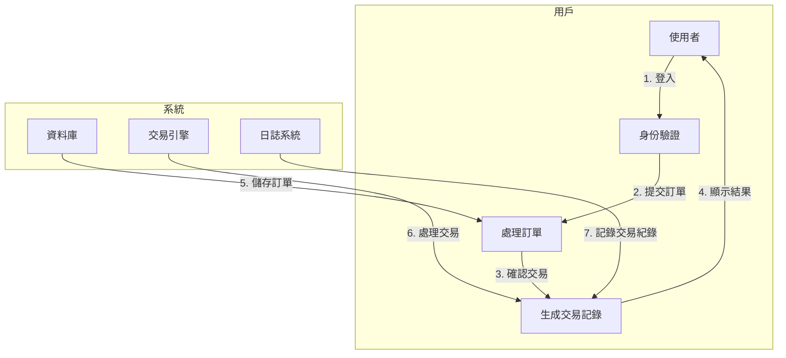

## 流程圖

```mermaid
graph TD

  subgraph 用戶
    A[使用者] -->|1. 登入| B[身份驗證]
    B -->|2. 提交訂單| C[處理訂單]
    C -->|3. 確認交易| D[生成交易記錄]
    D -->|4. 顯示結果| A
  end

  subgraph 系統
    E[資料庫] -->|5. 儲存訂單| C
    F[交易引擎] -->|6. 處理交易| D
    G[日誌系統] -->|7. 記錄交易紀錄| D
  end

```
