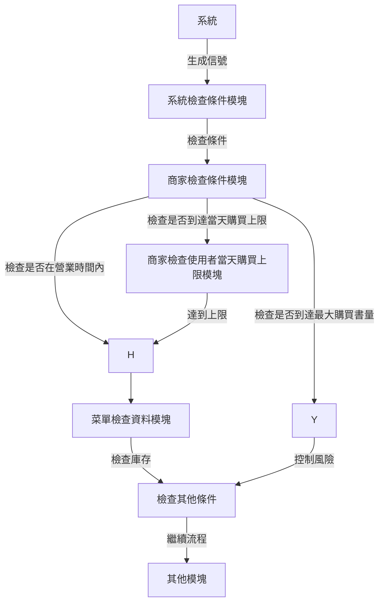

## 流程圖

```mermaid

graph TD
  A[系統] -->|生成信號| Z[系統檢查條件模塊]
  Z -->|檢查條件| X[商家檢查條件模塊]
  X -->|檢查是否到達最大購買書量| Y
  X -->|檢查是否在營業時間內| H --> B[菜單檢查資料模塊]
  B -->|檢查庫存| I[檢查其他條件]
  Y -->|控制風險| I
  I -->|繼續流程| C[其他模塊]
  X -->|檢查是否到達當天購買上限| M[商家檢查使用者當天購買上限模塊]
  M -->|達到上限| H


```
