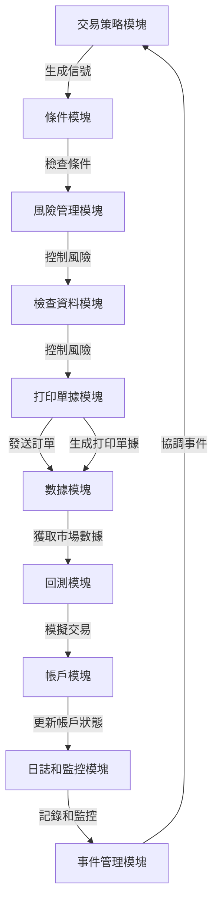

## 流程圖

```mermaid
graph TD
  A[交易策略模塊] -->|生成信號| Z[條件模塊]
  Z -->|檢查條件| X[風險管理模塊]
  X -->|控制風險| B[檢查資料模塊]

  B -->|控制風險| C[執行模塊]
  C -->|發送訂單| D[數據模塊]
  D -->|獲取市場數據| E[回測模塊]
  E -->|模擬交易| F[帳戶模塊]
  F -->|更新帳戶狀態| G[日誌和監控模塊]
  G -->|記錄和監控| H[事件管理模塊]
  H -->|協調事件| A

  C[打印單據模塊] -->|生成打印單據| D

```
