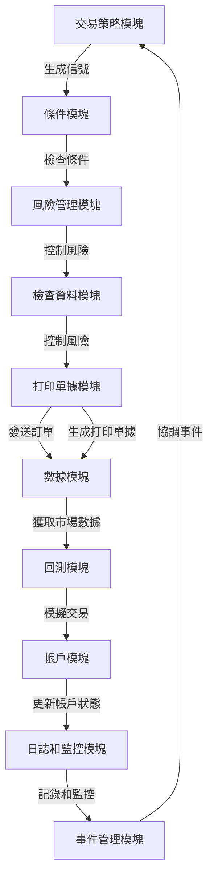
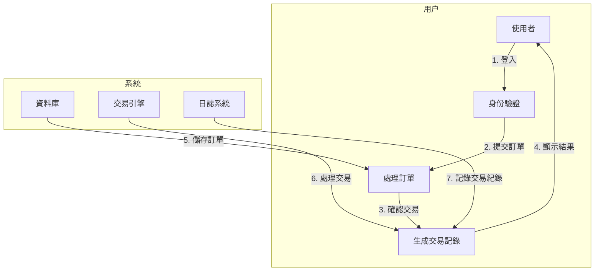

## 流程圖

```mermaid
graph TD
  A[交易策略模塊] -->|生成信號| Z[條件模塊]
  Z -->|檢查條件| X[風險管理模塊]
  X -->|控制風險| B[檢查資料模塊]

  B -->|控制風險| C[執行模塊]
  C -->|發送訂單| D[數據模塊]
  D -->|獲取市場數據| E[回測模塊]
  E -->|模擬交易| F[帳戶模塊]
  F -->|更新帳戶狀態| G[日誌和監控模塊]
  G -->|記錄和監控| H[事件管理模塊]
  H -->|協調事件| A

  C[打印單據模塊] -->|生成打印單據| D

```

### 流程

```mermaid

graph TD

  subgraph 用户
    A[使用者] -->|1. 登入| B[身份驗證]
    B -->|2. 提交訂單| C[處理訂單]
    C -->|3. 確認交易| D[生成交易記錄]
    D -->|4. 顯示結果| A
  end

  subgraph 系統
    E[資料庫] -->|5. 儲存訂單| C
    F[交易引擎] -->|6. 處理交易| D
    G[日誌系統] -->|7. 記錄交易紀錄| D
  end
```
